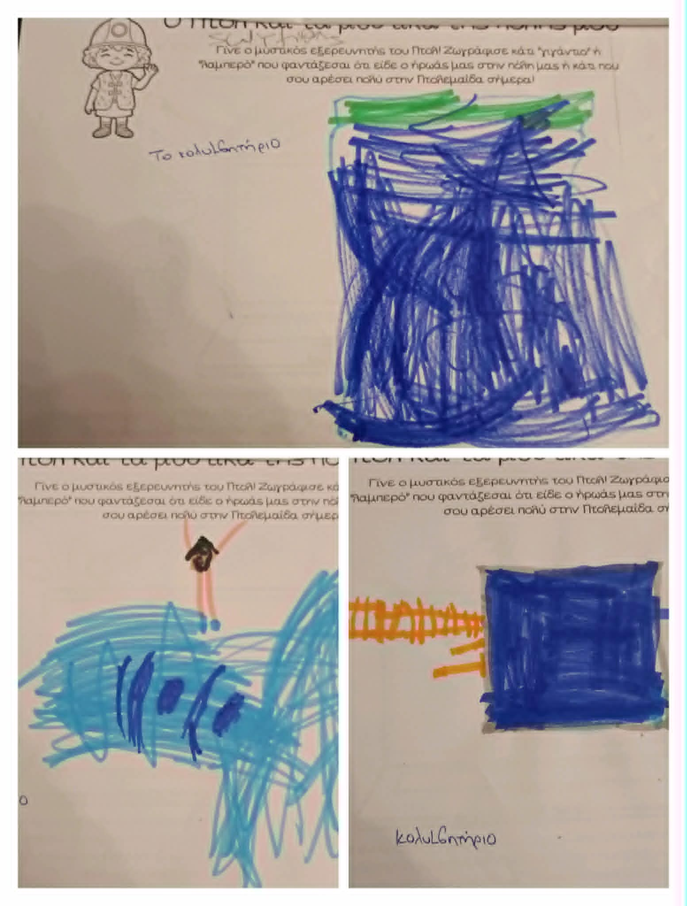

Ο Πτολ και τα Μυστικά της Πτολεμαΐδας
'Όνομα Ομάδας «Οι Μικροί Εξερευνητές του Πτολ»

 ΤΑΥΤΟΤΗΤΑ ΤΟΥ ΕΡΓΟΥ
Σύντομη Περιγραφή
Το έργο έχει ως στόχο τη γνωριμία των μαθητών με την τοπική ιστορία και τα μνημεία της πόλης τους, μέσα από το Storytelling (αφήγηση ιστοριών) και την Ανοιχτή Τεχνολογία. Μέσα από ένα παιχνίδι ρόλων, οι μαθητές βοηθούν τον χρονοταξιδιώτη «Πτολ» να ανακαλύψει το παρελθόν της Πτολεμαΐδας. Χρησιμοποιώντας ελεύθερο λογισμικό και απλά υλικά, τα παιδιά δημιουργούν ένα διαδραστικό βιβλίο που «ζωντανεύει» με ήχο και εικόνα, βοηθώντας τα να μάθουν την ιστορία του τόπου τους με έναν διασκεδαστικό και ψηφιακό τρόπο.
Βασικός Στόχος
Η καλλιέργεια των ψηφιακών δεξιοτήτων, της δημιουργικότητας και της συνεργασίας των μαθητών, μέσα από τον σχεδιασμό ενός διαδραστικού βιβλίου με τη χρήση της πλακέτας Makey Makey και του περιβάλλοντος προγραμματισμού Scratch.
Επιμέρους Στόχοι
Καλλιέργεια ήπιων και ψηφιακών δεξιοτήτων (συνεργασία, επικοινωνία, ψηφιακός εγγραμματισμός, δημιουργική σκέψη).
Εισαγωγή των μαθητών στις βασικές αρχές του προγραμματισμού και της υπολογιστικής σκέψης, μέσα από το περιβάλλον του Scratch.
Εξοικείωση με την Ανοιχτή Τεχνολογία και τα ηλεκτρικά κυκλώματα, χρησιμοποιώντας την πλακέτα Makey Makey και καθημερινά αγώγιμα υλικά (αλουμινόχαρτο, πλαστελίνη).
Ανάπτυξη δεξιοτήτων διαχείρισης και επεξεργασίας πολυμέσων (ηχογράφηση φωνής και επεξεργασία εικόνας) με τη χρήση ελεύθερων λογισμικών (Audacity / Scratch).
Κατάκτηση βιωματικής και ιστορικής γνώσης μέσα από την εξερεύνηση των σημαντικότερων σταθμών της Πτολεμαΐδας.
Ενίσχυση της συνεργασίας και του δεσμού της σχολικής τάξης με την τοπική κοινότητα (γονείς, τοπικοί φορείς) για τη συλλογή και ανάδειξη του ιστορικού υλικού.
Τεχνολογικά Εργαλεία & Υλοποίηση
•	Scratch
•	Compatible Makey Makey 
Για την υλοποίηση του έργου χρησιμοποιήθηκε η πλακέτα Makey Makey και η γλώσσα οπτικού προγραμματισμού Scratch. Για το ηχητικό μέρος (αφηγήσεις, εφέ) αξιοποιήθηκαν οι λειτουργίες ηχογράφησης του Scratch και το ελεύθερο λογισμικό Audacity. Για το σχεδιασμό και τη δημιουργία του χαρακτήρα του Πτολ χρησιμοποιήθηκε το Gemini Ai Image Generator και το Chatter pix για την εμψύχωση του ήρωα. Οι μαθητές σχεδίασαν τις σελίδες του βιβλίου χρησιμοποιώντας καθημερινά υλικά ( χαρτόνια, μπογιές, σύρμα πίπας κ.ά. ) αλλά και αγώγιμα υλικά (αλουμινοταινία, διπλόκαρφα). Όταν κάποιος αγγίζει μια σελίδα, το Makey Makey στέλνει εντολή στο Scratch να προβάλει φωτογραφίες της πόλης και να αναπαράγει την αντίστοιχη ηχογράφηση, «ζωντανεύοντας» έτσι την ιστορία της πόλης μας.
 ΥΛΟΠΟΙΗΣΗ ΤΟΥ ΕΡΓΟΥ
Α’ ΦΑΣΗ - ΕΙΣΑΓΩΓΗ & ΤΟ ΕΝΑΥΣΜΑ
Όλα ξεκίνησαν όταν ένα μήνυμα έφτασε στην τάξη μας!
Η Ψηφιακή Αφορμή: Η νηπιαγωγός, αξιοποιώντας εργαλεία Τεχνητής Νοημοσύνης (AI) για τη δημιουργία της εικόνας και την εφαρμογή ChatterPix για την εμψύχωση και ηχογράφηση, δημιούργησε και «ζωντάνεψε» τον ψηφιακό ήρωα του έργου, τον Πτολ.
Ένας παράξενος χρονοταξιδιώτης, ο «Πτολ», εμφανίστηκε στην οθόνη μας και ζήτησε τη βοήθεια των παιδιών για να γράψει ένα βιβλίο για την ιστορία της Πτολεμαΐδας. Μας αποκάλυψε ότι στα ταξίδια του στον χρόνο είδε απίστευτα πράγματα στην περιοχή μας: «πράγματα τεράστια» αλλά και «πράγματα που λάμπουν στο σκοτάδι»!
Αμέσως μετά, ακολουθήσαμε τη διαδικασία της ιδεοθύελλας στην παρεούλα. Με αφορμή τα λόγια του Πτολ, προσπαθήσαμε να μαντέψουμε τι μπορεί να συνάντησε στην πόλη μας, αποτυπώνοντας έτσι τις πρότερες γνώσεις των παιδιών για την Πτολεμαΐδα. Τι να ήταν άραγε τα τεράστια πράγματα; Μήπως τα μαμούθ ή οι μεγάλες μπουλντόζες στα ορυχεία; Και τι ήταν αυτό που έλαμπε στο σκοτάδι; Μήπως η φωτισμένη πόλη, το υδραγωγείο ή το ρεύμα από τα εργοστάσια της ΔΕΗ;
Τα παιδιά αποτύπωσαν τις ιδέες και τις υποθέσεις τους σε ζωγραφιές, κάνοντας την πρώτη τους καταγραφή για την ιστορία του τόπου τους!
 

## Άδεια
Creative Commons Attribution 4.0 (CC BY 4.0)
# ptol-secrets-of-ptolemaida
